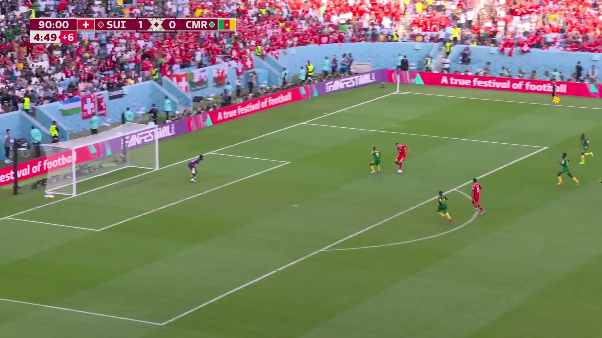
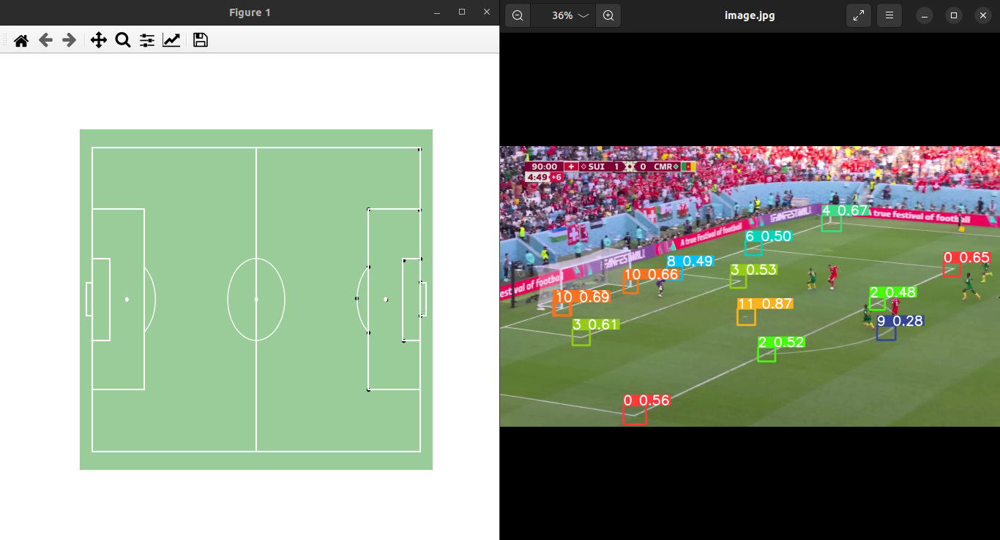
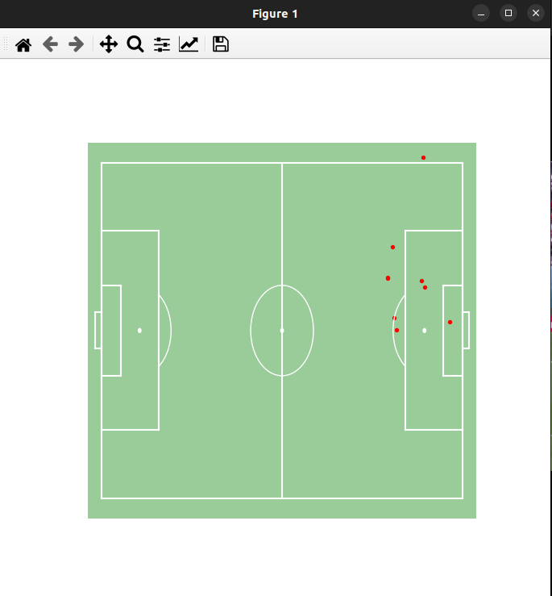

# Football-TV2Radar

## Project Overview

Football-TV2Radar is a project designed to transform a TV broadcast image of a football match into a 2D pitch representation. This transformation is achieved through the following steps:
1. **Keypoint Detection**: Utilizing the YOLOv8 model to identify key points on the football pitch.
2. **Homography Transformation**: Applying a homography transformation to map the TV image onto a 2D pitch representation.
3. **Player Detection**: Detecting player locations using another YOLOv8 model.
4. **Player Position Mapping**: Calculating player positions on the 2D pitch using the previously determined homography matrix.

The following sections provide a detailed explanation of each step, accompanied by visual examples.

## Key Features

1. **Keypoint Detection**:
   - Uses YOLOv8 to detect key points on the football pitch from a TV broadcast image.
   - These key points are crucial for accurately mapping the TV image to the 2D pitch.

2. **Homography Transformation**:
   - A homography matrix is computed using the detected key points.
   - This matrix is then used to transform the TV image to a 2D pitch view.

3. **Player Detection**:
   - A separate YOLOv8 model is employed to detect players in the TV broadcast image.
   - The detected player locations are then mapped to the 2D pitch using the homography matrix.

4. **Player Position Mapping**:
   - The positions of the players in the TV image are converted to their corresponding positions on the 2D pitch.
   - This step ensures an accurate representation of player locations on the 2D pitch.

## Visual Examples

### TV Image
The original TV broadcast image of a football match.

### Keypoint Detection and Homography Transformation
The image on the left shows the YOLOv8 keypoint detection on the TV image, while the image on the right displays the corresponding points on the 2D pitch.

### Player Detection and Position Mapping
The detected player positions on the TV image are mapped to the 2D pitch, resulting in an accurate representation of player locations.

## How to Use

1. **Setup**:
   - Clone the repository: `git clone https://github.com/yourusername/Football-TV2Radar.git`
   - Install the required dependencies: `pip install -r requirements.txt`

2. **Running the Model**:
   - Run the script to process the TV image: `python main.py --corner path_to_corner_detection_model --player path_to_player_detection_model --inp path_to_image`

3. **Visualization**:
   - Visualize the key points, homography transformation, and player positions using the provided visualization scripts.
